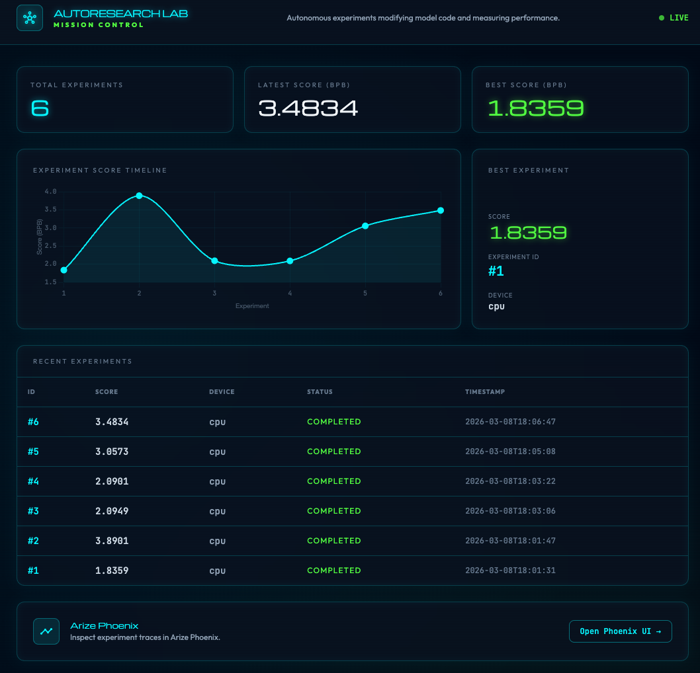
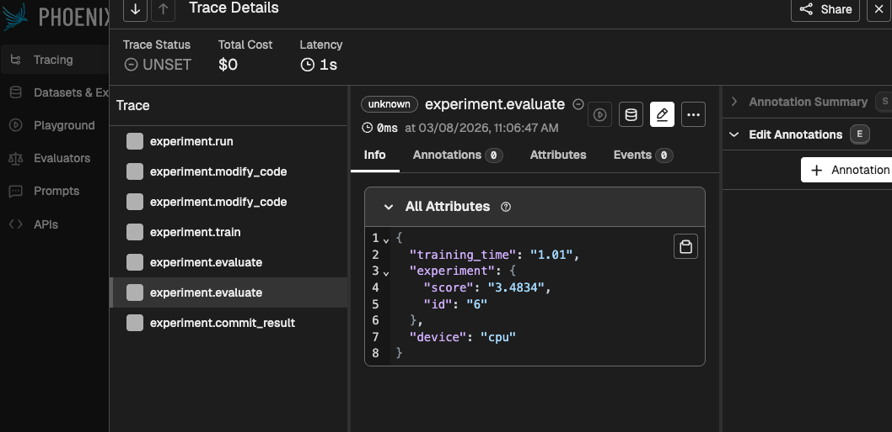

# AutoResearch Lab

> A fork of [Andrej Karpathy's autoresearch](https://github.com/karpathy/autoresearch) — extended with **Apple Silicon support**, **Arize Phoenix observability**, and a **Mission Control dashboard**.

An autonomous ML research loop where a Claude agent modifies model code, trains for 5 minutes, evaluates the result, keeps improvements, discards regressions, and repeats — indefinitely.

---

## Mission Control

Every experiment run is tracked in a live dashboard showing score progression, best result, and recent history.

---

## Arize Phoenix Tracing

Every experiment emits OpenTelemetry spans to Arize Phoenix — giving full trace visibility into each step: `experiment.run` → `experiment.modify_code` → `experiment.train` → `experiment.evaluate` → `experiment.commit_result`.

---

## What this fork adds

### 🍎 Apple Silicon (MPS) support
Runs natively on M1/M2/M3 Macs. Device detection falls back CUDA → MPS → CPU automatically. CUDA-only operations (FA3 flash attention, `torch.compile`) are replaced with MPS-compatible equivalents. Full 5-minute experiment loop works unchanged.

### 📡 Arize Phoenix tracing
`app/backend/arize_logger.py` wraps OpenTelemetry and emits structured spans to a local Phoenix instance. Every experiment step is a traceable span with attributes like `experiment.score`, `device`, `training_time`. Fails silently if Phoenix is offline.

### 📊 Mission Control report
`scripts/generate_report.py` reads experiment results and renders a static HTML dashboard — timeline chart, best-result card, run statistics, and a direct link to Phoenix traces. No server required.

### 🧠 Research learnings log
`learnings.md` is a living document the agent updates after every experiment: what it tried, result, mechanistic hypothesis, and next idea. After the full 1-hour session the agent writes an `END-OF-SESSION RESEARCH SUMMARY` with ranked findings, key insights, active hypotheses, advice for the next researcher, and a time-to-target estimate.

---

## Quick start

→ **[Setup guide](docs/setup.md)**

---

## How the research loop works

The agent follows `program.md` — a set of instructions that define the experiment loop:

1. Modify `train.py` with one idea
2. Commit and run: `uv run train.py` (5-minute budget)
3. Read `val_bpb` — the validation bits-per-byte metric (lower = better)
4. If improved → keep the commit and advance. If not → revert.
5. Update `results.tsv` and `learnings.md`
6. Repeat indefinitely

After ≥12 experiments and ≥60 minutes, the agent writes a full research summary with hypotheses, ranked findings, and estimated time to reach further improvements.

---

## Upstream

Original concept and core engine by **Andrej Karpathy**: [karpathy/autoresearch](https://github.com/karpathy/autoresearch)

> The upstream files (`train.py`, `prepare.py`, `program.md`, `pyproject.toml`) are kept clean at the repo root so future upstream merges remain straightforward.
